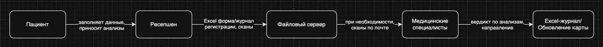
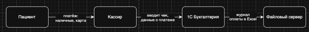
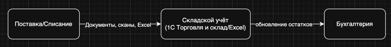
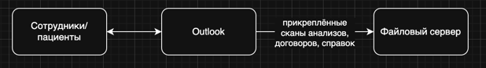
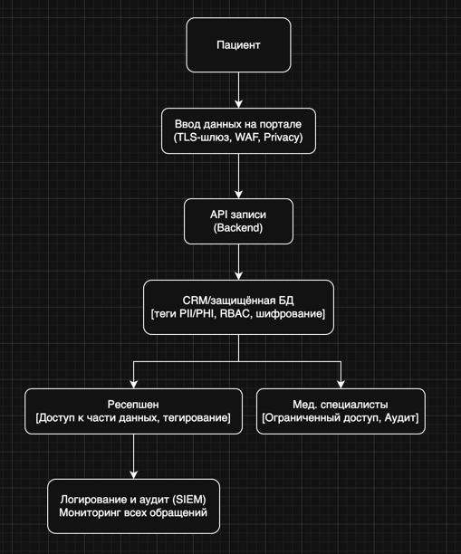
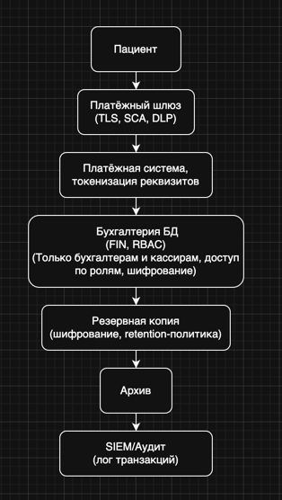
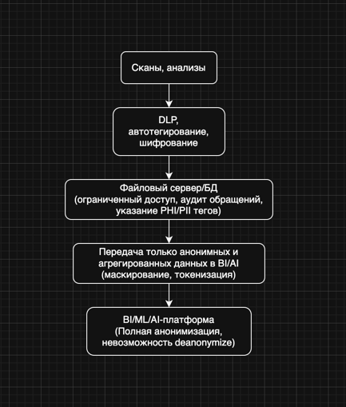
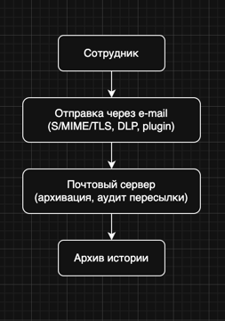

# Задание 1

## 1. Выявление конфиденциальных данных и составление диаграмм DFD

### Краткий анализ источников и наличия неучтённых данных
В компании «Медикаменте» вся работа ведётся вручную, с использованием Excel, сканов, локального файлового хранилища и 1С. Потоки данных слабо регулируются, аудит отсутствует, нет тегирования и классификации. Доступ к данным потенциально имеют все сотрудники в офисе.

#### Конфиденциальные данные, которые могут быть не учтены во внутренних системах:
- Медицинские карты пациентов (сканы/Excel), хранящиеся без контроля доступа - ПДн, PHI.
- Журналы приёма и учёта пациентов (Excel) - ФИО, контакты, история болезни, услуги.
- Платёжная информация, связывающая пациента с оплатой.
- Сведения о самих сотрудниках (Excel, 1С).
- Сканы анализов, результатов и заключений.
- Архивы электронной почты (личные/медицинские данные).
- Информация о ТМЦ (косвенно может содержать информацию о пациентах, например, поставки по рецептам).

#### Категории данных:
- PII (персональные данные): ФИО, паспортные данные, контакты и пр.
- PHI (медицинские данные): диагнозы, результаты обследований, анализы.
- Финансовые данные: чеки, платежи, счета, реквизиты.
- HR-данные: персональная информация сотрудников (табели, зарплата).
- Лог-файлы и метаданные доступа (на данный момент отсутствуют).

### Диаграммы потоков данных (DFD) - AS-IS

#### 1. Поток: Запись и приём пациента
[Запись и приём пациента.drawio](%D0%97%D0%B0%D0%BF%D0%B8%D1%81%D1%8C%20%D0%B8%20%D0%BF%D1%80%D0%B8%D0%B5%CC%88%D0%BC%20%D0%BF%D0%B0%D1%86%D0%B8%D0%B5%D0%BD%D1%82%D0%B0.drawio)

#### 2. Поток: Учёт и обработка платежей
[Учёт и обработка платежей.drawio](%D0%A3%D1%87%D0%B5%CC%88%D1%82%20%D0%B8%20%D0%BE%D0%B1%D1%80%D0%B0%D0%B1%D0%BE%D1%82%D0%BA%D0%B0%20%D0%BF%D0%BB%D0%B0%D1%82%D0%B5%D0%B6%D0%B5%D0%B8%CC%86.drawio)

#### 3. Поток: Учёт ТМЦ
[Учёт ТМЦ.drawio](%D0%A3%D1%87%D0%B5%CC%88%D1%82%20%D0%A2%D0%9C%D0%A6.drawio)

#### 4. Поток: Почтовый документооборот
[Почтовый документооборот.drawio](%D0%9F%D0%BE%D1%87%D1%82%D0%BE%D0%B2%D1%8B%D0%B8%CC%86%20%D0%B4%D0%BE%D0%BA%D1%83%D0%BC%D0%B5%D0%BD%D1%82%D0%BE%D0%BE%D0%B1%D0%BE%D1%80%D0%BE%D1%82.drawio)

## 2. Аудит мер по обеспечению безопасности данных (AS-IS)

### Текущие меры
- Доменная аутентификация через AD (Active Directory), но дозволены общие папки без аудита;
- Нет ролевого разграничения доступа (RBAC/ABAC не реализован);
- Нет шифрования данных ни в хранилищах, ни при передаче (кроме вероятной защиты через AD паролем);
- Нет процесса тегирования/классификации данных (отсутствует понятие «чувствительных» данных);
- Нет автоматического аудита и мониторинга доступа к файлам;
- Вся обработка и передача данных ведётся вручную, нет контроля за копированием/отправкой;
- Нет политики инцидент-менеджмента (утечки не фиксируются);
- Резервные копии не защищены отдельно.

### Проблемные зоны
- Общий файловый сервер: доступен по локалке, все сотрудники могут случайно или осознанно просмотреть, скопировать или отправить файл.
- Excel-файлы и сканы: не шифруются, легко пересылаются между сотрудниками, копируются на внешние носители.
- Логирование/аудит: отсутствует, невозможно выяснить, кто когда обращался к данным.
- Разделение доступа: один и тот же файл может быть доступен и медикам, и ресепшену, и кассирам.
- Передача по электронной почте: можно отправить любые данные без шифрования, без политики traceability.
- Нет удаления по запросу: если пациент пожелает удалить данные, нет единой процедуры или автоматизированного механизма.
- Нет сегментации данных по доменам: все данные смешаны, т.е. профиль клиента и его анализы могут оказаться в одной папке.
- Нет формата для тегов или классификации (PHI/PII/финансы/HR/ТМЦ).
- Ограниченное резервное копирование: уязвимо к физическим угрозам (пожар, кража), нет разнесённых копий.

## 3. Предложения по улучшениям: способы защиты и автоматизация

### Список данных для защиты и способы их защиты

| Категория данных        | Что защищать             | Требуемый способ защиты                                                                                                                                    |
| ----------------------- | ------------------------ | ---------------------------------------------------------------------------------------------------------------------------------------------------------- |
| Мед. карты, PHI         | Сканы, диагнозы, истории | Шифрование в покое и при передаче; тегирование как PHI; RBAC/ABAC, аудит доступа, шифрование резервных копий, сегментировать по отделам, ограничить доступ |
| Персональные данные     | ФИО, контакты, адреса    | Шифрование, тегирование как PII, маскирование в отчётах, RBAC/ABAC, аудируемый доступ, автоудаление по запросу                                             |
| Платежи/финансы         | Чеки, счета, реквизиты   | Шифрование, токенизация (замена реквизитов), строгий RBAC, внешний доступ запрещён; аудит операций                                                         |
| Сотрудники (HR)         | Личные данные            | Ограничение доступа, шифрование, тегирование как HR, инвентаризация                                                                                        |
| Электронная почта       | Вложения, переписка      | DLP-инструменты, шифрование вложений, аудит отправки-сохранения                                                                                            |
| Логи доступа и действий | Метаданные               | Аудит логов, контрольных точек                                                                                                                             |

### Рекомендации по инструментам, процессам и мерам

#### 1. Инвентаризация и DLP/Discovery
- Внедрить автоматизированные DLP-системы (например, Symantec DLP, Microsoft Purview, BigID) для поиска чувствительных данных на всех ресурсах.
- Произвести разметку: тегирование файлов, баз данных по категориям (PII, PHI, FIN, HR и др).

#### 2. Механизм тегирования
- Внедрить Data Catalog/Data Governance платформу (например, Collibra, Apache Atlas, Informatica) или использовать теги NTFS, если внедрение платформ невозможно сразу.
- Создать политику тегирования на базе классификации данных: каждая единица данных (файл/таблица/строка) получает тег в момент создания или загрузки.
- Встроить автотегирование для вновь создаваемых документов по шаблонам.

#### 3. Система контроля доступа
- Для файлового сервера - пересмотреть ACL, назначить доступ по ролям (группы «Ресепшен», «Врачи», «HR» и пр).
- В новой архитектуре: реализовать RBAC/ABAC на уровне приложений и баз данных.

#### 4. Шифрование
- Для данных в покое - применить BitLocker (Windows Server) или шифрование на уровне БД (Postgres: TDE, Microsoft SQL Server: TDE).
- Для передачи - использовать шифрование файлов (GPG/S-MIME) и защищённую почту (TLS), запретить обычные почтовые вложения без шифрования.
- Для резервного копирования - шифровать бэкапы, хранить отдельные копии в защищенном помещении, возможно использовать облачный HSM.

#### 5. Обфускация и маскирование
- Для не-продакшн сред и отчётов - реализовать маскирование персональных и медицинских данных (например, в BI-системах, разработке).
- Для передачи данных на тестирование - обфусцировать сканы и логи.

#### 6. Журналирование и аудит
- Ввести логи доступа и изменений к критичным данным.
- Включить централизованный аудит доступа (например, через SIEM).
- Определить политики по мониторингу и оповещению (инциденты, массовый экспорт, нетипичные запросы).

#### 7. Управление жизненным циклом данных
- Организовать процессы минимизации хранения: удаление неактуальных и дублей, автоархивация.
- Реализовать реагирование на запросы пациентов на удаление данных.

#### 8. Обучение сотрудников
- Провести тренинги по работе с конфиденциальной информацией, политиками безопасности, реагированию на инциденты.

### Доработанная Data Flow Diagram (TO-BE)

#### 1. Запись и обслуживание пациента
[Запись и обслуживание пациента.drawio](%D0%97%D0%B0%D0%BF%D0%B8%D1%81%D1%8C%20%D0%B8%20%D0%BE%D0%B1%D1%81%D0%BB%D1%83%D0%B6%D0%B8%D0%B2%D0%B0%D0%BD%D0%B8%D0%B5%20%D0%BF%D0%B0%D1%86%D0%B8%D0%B5%D0%BD%D1%82%D0%B0.drawio)

#### 2. Финансовый поток
[Финансовый поток.drawio](%D0%A4%D0%B8%D0%BD%D0%B0%D0%BD%D1%81%D0%BE%D0%B2%D1%8B%D0%B8%CC%86%20%D0%BF%D0%BE%D1%82%D0%BE%D0%BA.drawio)

#### 3. Архив, сканы, BI-платформа
[Архив, сканы, BI-платформа.drawio](%D0%90%D1%80%D1%85%D0%B8%D0%B2%2C%20%D1%81%D0%BA%D0%B0%D0%BD%D1%8B%2C%20BI-%D0%BF%D0%BB%D0%B0%D1%82%D1%84%D0%BE%D1%80%D0%BC%D0%B0.drawio)

#### 4. Почта
[Почта.drawio](%D0%9F%D0%BE%D1%87%D1%82%D0%B0.drawio)

