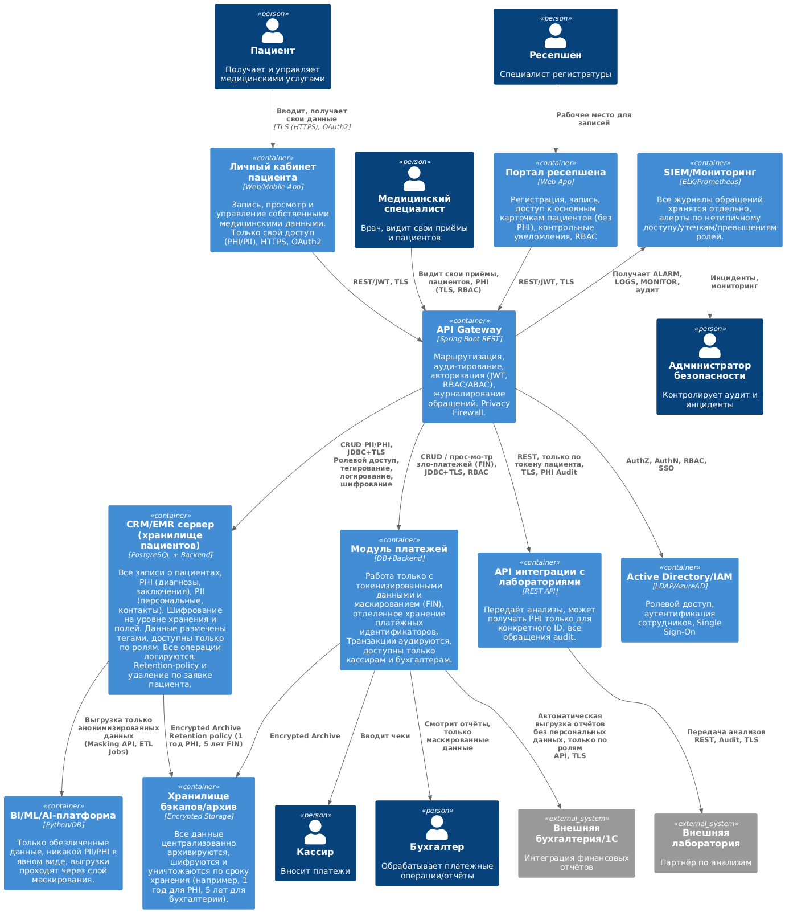

# Задание 2

## Решение To-Be для MVP

### 1. Краткое описание архитектуры
- В центре - Единая защищённая CRM/EMR-система на сервере (или в защищённом облаке, расположенном на территории РФ).
- Данные пациентов и их истории хранятся централизованно, сегментированы по ролям, классифицированы тегами (PII, PHI, FIN и др.).
- Доступ сотрудников - строго по ролям (RBAC/ABAC): кассир, медик, ресепшен, ИТ, BI.
- Все обращения к данным журналируются/аудируются.
- Взаимодействие с внешними системами (лаборатории, мобильное приложение и прочие) - только через защищённые API-шлюзы с контролем доступа.
- BI и аналитика - только на обезличенных (маскированных) данных.
- Резервное копирование - исключительно в зашифрованном виде, копии разнесены территориально.
- Система реализует автоматическое выполнение норм ФЗ-152: уведомление о целях обработки, удаление данных по запросу, аудит инцидентов.

### 2. Диаграмма контейнеров в стиле C4

#### Контейнеры:
1. Веб-портал для пациентов
   - Личный кабинет: самостоятельная запись к врачу, просмотр своих данных, подтверждение/отмена визитов
   - Взаимодействует только по защищённому соединению (HTTPS/TLS, JWT, OAuth2).
2. Веб-портал для ресепшена  
   - Интерфейс для проверки записей, отправки напоминаний, поиска по пациенту  
   - Доступ к расширенным данным - только по ролям (RBAC)  
   - Аудит всех действий.
3. CRM/EMR-сервер (Ядро)  
   - Единое хранилище всех записей, карты пациентов в защищённой БД  
   - Данные сегментированы и промаркированы тегами (PII/PHI/FIN).  
   - Хранение - шифрование в покое (TDE, field-level).  
   - Поддержка автоматической минимизации и уничтожения данных (Retention Policies).  
   - Журнал действий (аудит), интеграция с SIEM.
4. Платёжный шлюз  
   - Приём платежей, валидация, связь с 1С или другими финансовыми системами  
   - Чувствительная информация токенизируется/маскируется  
   - Хранение платёжных данных - в отдельном, защищённом сервисе с RBAC.
5. Сервис интеграции с лабораториями  
   - Работа только через закрытые API: каждый запрос - audit, идентификация сторон  
   - Доступ к PHI только по токену, журналирование обращений.
6. BI/ML/AI-платформа  
   - Получает только обезличенные и агрегированные данные из основного хранилища.
7. Резервный копировщик/Архив  
   - Регулярно выгружает бэкапы из защищённой БД в шифрованное хранилище (offsite).  
   - Копии уничтожаются автоматически по истечении срока хранения.
8. Active Directory/IAM  
   - Управление пользователями, ролями, Single-Sign-On, аудит входов.

### 3. Диаграмма контейнеров в модели C4

[C4_Container.puml](C4_Container.puml)

### 4. Протоколы хранения и уничтожения данных

#### Как хранить данные
- Все чувствительные поля (PII, PHI, FIN) хранятся только в централизованной защищённой БД (например, Postgres с TDE или MS SQL с Always Encrypted).
- Данные сегментированы по ролям доступа, промаркированы тегами (`PHI`, `PII`, `FIN`).
- Доступ ограничен: только приложениям/пользователям с нужной ролью и минимально необходимым объёмом.
- Резервные копии делаются автоматически, шифруются, хранятся обособленно, доступа нет с рабочей сети.
- Логи доступа и действия с данными автоматически отправляются в SIEM (например, ELK/Graylog/Wazuh).

#### Периоды и условия уничтожения данных
- Автоматическое удаление по завершении обработки (например, по истечении 1 года после последнего визита пациента - обговаривается в политике согласия, или по запросу пациента согласно ФЗ-152).
- Реализация retention policy: для каждой категории данных устанавливается срок хранения.
- Удаление по запросу: пациент может из ЛК или через ресепшен подать заявку на удаление - система гарантированно удаляет все его связанные данные (кроме необходимого бухгалтерского учёта и журналов, если это требуется законом) и освобождает их в резервных копиях после следующей итерации бэкапа.
- Сроки хранения финансовых данных соответствуют нормативам РФ (например, не менее 5 лет для налоговой).

#### Способы защиты данных (при хранении и передаче)
- Шифрование данных в покое: TDE на уровне БД, использование SED (Self Encrypting Drives) для серверов, шифрование бэкапов.
- Шифрование при передаче: только TLS 1.2+/HTTPS между всеми компонентами, VPN для внутренних сервисов и внешних интеграций.
- Маскирование/обезличивание: для аналитики, BI и ML - предоставление только анонимизированных (de-identified) данных.
- Токенизация платежей: хранение номеров карт и других особо чувствительных реквизитов в токенизированном виде (PCI DSS compliant).
- Контроль доступа: RBAC/ABAC в CRM, IAM для управления ролями, интеграция с Active Directory (SSO, журналирование логинов).
- Тегирование данных: автоматическое - по типу данных, ручное - для особых случаев, используется для триггеров DLP, маскирования, мониторинга доступа.
- Аудит и оповещение: любая неавторизованная попытка доступа фиксируется, оповещение по алертам на SIEM/безопасность.
- Activity-based Control: постоянный мониторинг нетипичных действий: массовая выгрузка, экспорт, нетипичные запросы.
